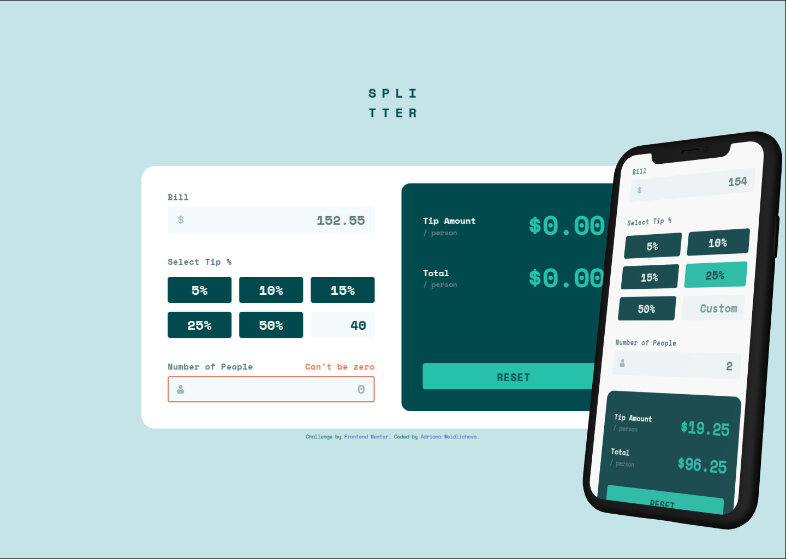

# Frontend Mentor - Tip calculator app solution

This is my solution to the [Tip calculator app challenge on Frontend Mentor](https://www.frontendmentor.io/challenges/tip-calculator-app-ugJNGbJUX). 

## Table of contents

- [Frontend Mentor - Tip calculator app solution](#frontend-mentor---tip-calculator-app-solution)
  - [Table of contents](#table-of-contents)
  - [Overview](#overview)
    - [The challenge](#the-challenge)
    - [Screenshot](#screenshot)
    - [Links](#links)
  - [My process](#my-process)
    - [Built with](#built-with)
    - [What I learned](#what-i-learned)
    - [Continued development](#continued-development)
    - [Useful resources](#useful-resources)
    - [AI Collaboration](#ai-collaboration)
  - [Author](#author)
  - [Acknowledgments](#acknowledgments)

## Overview

### The challenge

Users should be able to:

- View the optimal layout for the app depending on their device's screen size
- See hover states for all interactive elements on the page
- Calculate the correct tip and total cost of the bill per person
- **Bonus**: See a validation error when the number of people is set to zero while a bill is entered.

### Screenshot



### Links

- Solution URL: [Github repository](https://github.com/Saliva-sys/Tip-Calculator-App.git)
- Live Site URL: [Run locally](http://localhost:5173/)

## My process

### Built with

- Semantic HTML5 markup
- **Modern CSS** (HSL colors, Clamp for responsiveness)
- **Flexbox & CSS Grid**
- Mobile-first workflow
- [React](https://reactjs.org/) - JS library
- [Vite](https://vitejs.dev/) - Fast frontend tooling
- **BEM Methodology** for clean CSS naming

### What I learned

During this project, I focused on professional environment setup and advanced CSS techniques.

**1. CSS Specificity and Vendor Prefixes:**
I learned how to manage CSS specificity when combining IDs and classes to ensure error states (like the red border) are correctly displayed even when using global ID selectors.

```css
/* Using high specificity to override default ID styles */
.input-people.input-error {
    border: 2px solid var(--color-error);
}
```
2. Conditional Rendering in React:
I implemented "Eager Validation" where the error message for the "Number of People" field only appears once the user starts interacting with the "Bill" field.
JavaScript

```js
{(bill !== '' && (people === '0' || people === '')) && (
  <span className="error-message">Can't be zero</span>
)}
```
3. Modern CSS Syntax:
I started using the modern HSL syntax without commas and clamp() functions to create a truly fluid design without excessive media queries.

### Continued development

In future projects, I want to focus on:
- **Advanced React State Management**: I want to explore how to handle more complex forms and global states beyond simple `useState`.
- **Custom CSS Properties & Theming**: I plan to dive deeper into CSS variables to create even more flexible and maintainable design systems.
- **Accessibility (a11y)**: My goal is to ensure that my apps are fully usable for people navigating via keyboard or screen readers.

### Useful resources

- [React Documentation](https://react.dev/) - The new docs are incredibly clear and helped me refine my understanding of Hooks and state updates.
- [MDN Web Docs - CSS Grid](https://developer.mozilla.org/en-US/docs/Web/CSS/CSS_Grid_Layout) - This was my go-to reference for mastering grid-template-columns and responsive layouts.
- [BEM Methodology](https://getbem.com/) - Using BEM helped me keep my CSS organized and avoid naming conflicts, which is crucial for larger projects.

### AI Collaboration

This project was a great exercise in working with an AI assistant (Gemini 3 Flash).

- **Technical Brainstorming**: I used Gemini as a sparring partner to brainstorm layout solutions and debug complex CSS behaviors. This collaborative process helped me understand the "why" behind specific fixes rather than just applying them.
- **Debugging**: AI helped me resolve Stylelint errors regarding vendor prefixes and CSS Grid overflow issues.
- **Workflow**: Gemini assisted in setting up a professional Linting environment to keep the code clean and maintainable.

## Author

- Frontend Mentor - [@Saliva-sys](https://www.frontendmentor.io/profile/Saliva-sys)
- GitHub - [Saliva-sys](https://github.com/Saliva-sys)

## Acknowledgments

I would like to thank the Frontend Mentor community for providing such great challenges to practice real-world web development skills.
